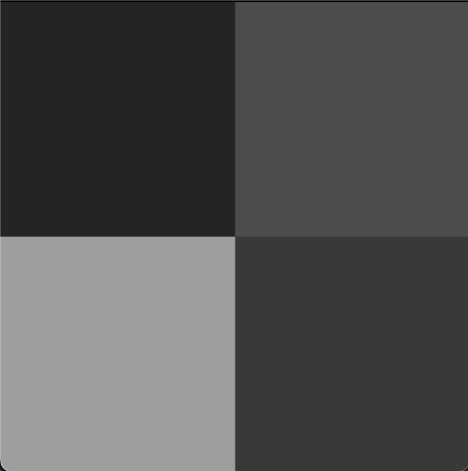
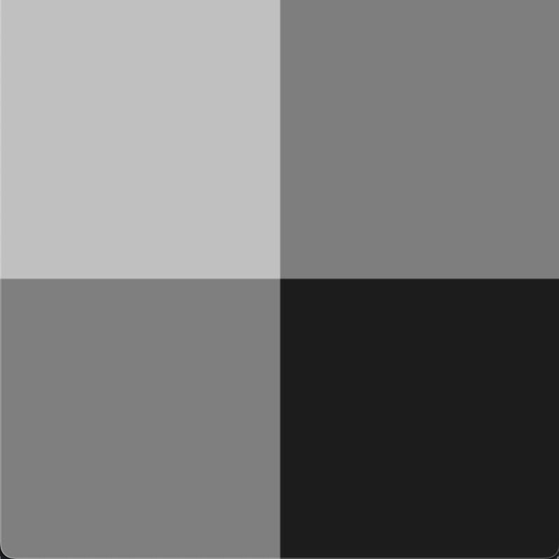
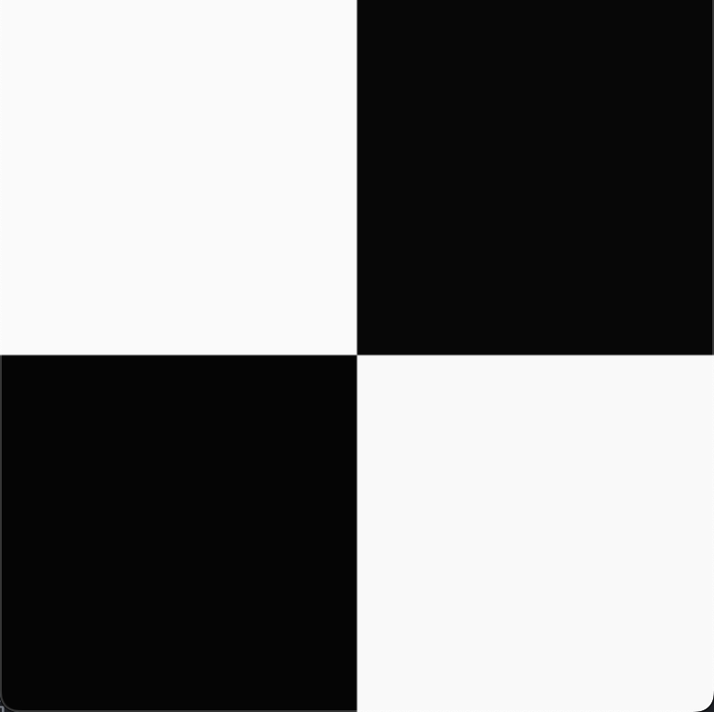
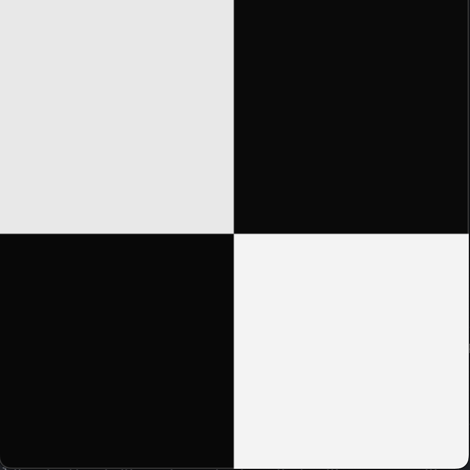
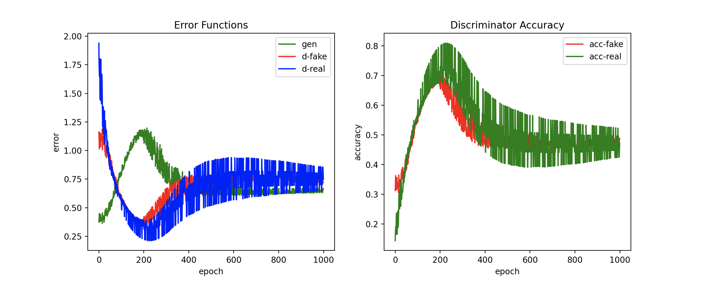

# tinyGAN

A demo project to test my understanding of Generative Networks by creating a simple Generative Adversarial Network. This project does not use any prewritten Deep Learning libraries.

The goal is to have the GAN produce a checkered pattern, with the top left and bottom right squares white and the top right and bottom left squares black.

## Initial State (noisy)

 |  | 
--- | --- | ---
seed(1) | seed(2) | seed(3)

## Final State (1000 epochs)

 |  | 
--- | --- | ---
seed(1) | seed(2) | seed(3)

## Statistics

seed(1), 1000 epochs

**Note that the seeds and the epochs are provided to replicate these results**
